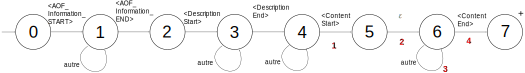

# Évolution du programme

## Semaine 1

### Objectif

Analyser le fonctionnement du programme, comprendre son architecture.
Introduction aux formats de fichier.

### Programme

Programme d'analyse du réseau 4G, prend en charge le format Zk-Samp.

4 étapes de fonctionnement :

1. **Configuration** : on choisit le répertoire de production des fichiers.
2. **Field-test \*.csv to \*.pcap and \*.json conversion** : lecture du fichier Zk-Samp, décodage. Production de
fichiers textes temporaires pour chaque dissecteur Wireshark (= *parsers* de paquet). Appel de `text2pcap` pour en 
faire des fichiers pcap. Fusion des fichiers temporaires `.pcap` avec `mergecap`. Ré-ordonnancement des paquets avec 
`reordercap` par horodatage ; obtention du fichier `.pcap` final. Production fichier JSON temporaire depuis `.pcap` 
final avec `tshark`. Ajout à ce fichier des données de géolocalisation ; production JSON `C_...`, contenant les données 
des paquets SIB et de chaque mesure.
3. **Cartoradio File Conversion** : production de fichiers "sites" et "zones" JSON pour chaque opérateur à partir de 
fichiers CSV de Cartoradio. Les fichiers "sites" donnent des informations sur les stations de bases (numéro, exploitant,
géoloc...), les fichier "zones" permettent la description des cellules associées. On se base sur 2 fichiers Cartoradio :
`Antennes_Emetteurs_Bandes_Cartoradio.csv`, contenant des informations sur les identifiants de stations de base, leur 
mise en service, les fréquences..., et `Sites_Cartoradio.csv` contenant les géolocalisations de ces stations de base, 
les adresses, les terrains utilisés...
On récupère les données de ces fichiers avec la bibliothèque `pandas`, permettant notamment d'organiser les données 
suivant  le modèle relationnel (`DataFrame`). On utilise alors une jointure naturelle pour lier les données, puis on les 
groupe par opérateur. On génère pour chaque opérateur 2 fichiers : un fichier `sites` (CSV) qui contient les 
informations de localisation et d'exploitant des stations de bases, et un fichier `Zone` (JSON) contenant les 
informations d'orientation des antennes, utiles pour calculer l'étendue de la cellule 4G.
4. **Cell Association Processing** : calcul du fichier JSON d'association utilisé par l'interface de visualisation. 
On lie les données du fichier `C_...` (RSRP, TAC, PCI...) avec celles du fichier `sites` (position, fréquences... 
des stations de base). On utilise à cette étape l'algorithme de Voronoi pour produire la délimitation des cellules 4G 
théoriques, en utilisant des groupements par PCI / EARFCN des données. Production d'un fichier `association` (JSON).

### Bugfixes
* Production NaN dans les géolocalisations dans les fichiers `Zone` : filtrage des NaN.

## Semaines 2 et 3

### Objectif
Analyse du format AOF d'Accuver Xcal. Pouvoir produire en fin de semaine une trace en format PCAP des messages LTE RRC 
(SIB, MesurementReports...).

### Structure des fichiers AOF
Les fichiers AOF sont écrits en CSV, avec pour séparateur le caractère `|`. Ils suivent la structure suivante :

* Informations de fichier (délimiteur ouvrant `<AOF_Information_START>`, fermant `<AOF_Information_END>`). Informations 
de fichier, version par exemple. Pas intéressant ici.

* Description de fichier (`<Description Start>` -> `<Description End>`) : contient la description des message utilisés. 
Chaque description est divisée en deux lignes : une ligne de nommage des messages de la forme 
`NOM_MESSAGE|champ1|champ2|champ3|...|champN` et une ligne de typage `NOM_MESSAGE|type1|type2|type3|...|typeN`, 
décrivant les types de chaque champ. 

    Formellement, une définition de message suit la syntaxe suivante :

    ```bnf
    <msg_def> ::= (<print_char>+ ("|" <print_char>+)+ <newline>){2}
    ```

    avec `<print_char>` désignant tout caractère imprimable, et `<newline>` un retour à la ligne. Pour rappel, l'exposant 
`+` signifie que le symbole doit être présent au moins fois, `{n}` que le symbole se répète `n` fois exactement.

    Sémantiquement, la seconde ligne doit contenir des types valides, et il doit y avoir autant de champs déclarés
sur la première ligne que de types sur la seconde.

    Cette partie présente un intérêt à la lecture manuelle du fichier, pour la compréhension de sa structure. 
Le programme étant construit à priori sur l'hypothèse que les messages sont bien formés, cette partie ne présente 
cependant pas d'intérêt au niveau de l'analyse par le programme.

* Contenu (`<Content Start>` -> `<Content End>`) : contient les messages enregistrés par Xcal. Chaque ligne débute par 
le nom du message, les valeurs sont ensuite spécifiées, on utilise le séparateur `|`.

    Syntaxiquement :

    ```bnf
    <msg_content> ::= (<print_char>* ("|" <print_char>*)+ <newline>)
    ```

    On rappelle que l'exposant `*` indique que le symbole associé peut paraître 0, 1, ou plusieurs fois.

    Sémantiquement, il doit y avoir pour un message le même nombre de champs que défini dans la partie description : le 
type de chaque champ doit correspondre au type donné pour ce champ dans la partie description.

### Structures des fichiers à produire.

#### Conversion vers PCAP

Pour chaque dissecteur Wireshark (associé à un canal), on doit générer un fichier texte,
contenant une notation textuelle pour chaque paquet. Format :
   
  ```
  YYYY-MM-DD HH:MM:SS.UUUUUU
  0000 XX XX XX XX
  ```

  où `XX XX XX XX` est le message en notation hexadécimale et `YYYY-MM-DD HH:MM:SS.UUUUUU` l'horodatage.

Les messages sur lesquels on travaille sont les messages RRC (Radio Resource Control) 
[[wiki](https://en.wikipedia.org/wiki/Radio_Resource_Control)]. Il s'agit d'un protocole de signalisation entre la
station de base et l'*User Equipment* (voir [ici](https://blogs.univ-poitiers.fr/f-launay/2015/05/08/protocole-rrc/))

Les canaux correspondant aux fichiers sont :
* `MAC-LTE-FRAMED` :
* `BCCH.BCH` : sur Broadcast Control Channel, infos sur la cellule.
* `BCCH.DL.SCH` : sur BCCH, Downlink Shared Channel, doonées de contrôle usager
* `DL.CCCH` : Downlink Common Control Channel, transmission de données de signalisation si DCCH non dispo (établissement
* de connexion RRC par exemple).
* `UL.CCCH` : Uplink Common Control Channel, transmission de données de signalisation si DCCH non dispo.
* `DL.DCCH` : Downlink Dedicated Control Channel, transmission de données de signalisation associée à l'utilisateur.
* `UL.DCCH` : Uplink Dedicated Control Channel, transmission de données de signalisation associée à l'utilisateur.

Ici, UL désigne une connexion *uplink*, c'est-à-dire de l'UE vers le réseau, et DL désigne une connexion *downlink*,
c'est-à-dire du réseau vers l'UE.

*(source: livre de la BU je ne sais plus lequel) (à modifier)*

#### Conversion vers JSON

Durant la phase d'analyse, deux types de données sont produites : les données `SIB`, liées aux paquets 
`SystemInformationBlock1`, contenant les données d'identification de la cellule (*Tracking Area Code*, *CellID*, 
*PLMN*), et les données `Mesurement`, liées aux données des messages `MeasurementReport`, contenant notamment le RSRP,
quantifiant la puissance du signal reçu.

Dans la première version, on utilise `pycrate` pour générer un dictionnaire au format ASN1 
(voir [wiki asn1](https://fr.wikipedia.org/wiki/ASN.1) et [ici](https://www.sstic.org/2018/presentation/pycrate/)), puis
on exploitait les données ASN1 pour produire le JSON final. Dans la seconde version, utilise les messages `QCLTE_PSCELL`
du fichier AOF pour récupérer les données nécessaires au `SIB`, `QCLTE_CELLINFO` pour les `Mesurement`.

Les entrées `SIB` suivent la structure suivante :
```json
{
    "Mesurement": {
        "PCI": "82",
        "EARFCN": "6300",
        "Geolocation": {
            "lat": "48.12014",
            "lng": "-1.62954"
        },
        "RSRP": 45,
        "neighbourMax_RSRP": -1000
    }
}
```

* Le `PCI` désigne le Physical Cell Identifier, identifiant physique de la cellule.
* L'`EARFCN` (Extended Absolute Radio Frequency Channel Number), code associé à la fréquence.
* `Geolocation` : géolocalisation, latitude `lat` et longitude `lng`.
* `RSRP` : Reference signal received power, mesure logarithmique de la puissance reçue d'une fréquence d'une station de
base, exprimée en dBm (décibels milliwatts).
* `neighbourMax_RSRP`, différence entre le RSRP reçu et le RSRP de station de base voisne le plus fort. (non implémenté)

```json
{
    "SIB": {
        "TAC": "c0:fa",
        "CellID": "09:77:19:07",
        "PCI": "82",
        "EARFCN": "6300",
        "geolocation": {
            "lat": "48.12010",
            "lng": "-1.62953"
        },
        "mcc": "208",
        "mnc": "10"
    }
}
```

* Le `TAC` (Tracking Area Code)
* Le `CellID`, identifiant distinguant la cellule des autres cellules voisines.
* Le `MCC` (Mobile Country Code) et le `MNC` (Mobile Network Code) sont deux identifiants caractérisant le `PLMN`
(Public Land Mobile Network), le `MCC` donnant le pays de la cellule (208 pour la France par ex.), et le `MNC` donnant
l'opérateur (10 pour SFR par ex.).

On produira un `Mesurement` pour chaque point GPS trouvé dans le fichier AOF ; on utilisera alors les données obtenues
par les derniers messages `QCLTE_CELLINFO` et `QCLTE_PSCELL`. On produira un `SIB` à chaque message `QCLTE_CELLINFO`
trouvé.

### Analyse sur la structure du fichier

Dans le cadre du programme de visualisation, il n'est pas nécessaire de vérifier toutes les contraintes syntaxiques et 
sémantiques définies précédemment ; il suffira en fait d'analyser certains points précis de la structure du fichier, 
servant de repère au programme.

Ces points seront les suivants :

* On a vu qu'il y avait 3 parties : informations fichier, description et contenu. Les messages se trouvent dans la 
partie contenu ; on utilisera donc les délimiteurs vus dans la partie précédente pour identifier les parties pertinentes
à analyser. On choisira, même si cela n'est pas forcément nécessaire à l'analyse, de s'assurer du bon ordre des 
parties : information, puis description, puis contenu.
* On reconnaîtra les messages à analyser à leur nom, précisé en première colonne (exemple : `GPS` pour les données GPS, 
`QCLTE_RRCMSG_V2` pour les messages RRC).
* Pour exploiter le contenu des messages, on utilisera simplement le séparateur `|` pour découper le message sous forme de 
liste.

Les repères utilisés pour identifier les messages et les sections ont pour avantage de se trouver en première colonne du
CSV : on utilisera donc les contenus des premières colonnes comme symboles d'analyse.

La structure du langage du fichier n'impliquant pas d'imbrication, et pouvant se lire sans retenir d'autre information
que la section courante, on peut intuitivement dire que ce dernier et rationnel, donc analysable par un automate fini.

On proposera l'automate suivant : 



Celui-ci exécutera des actions sémantiques au fur et à mesure de la reconnaissance du fichier, numérotées en rouge :

1. Écriture `[` ouvrant fichier JSON de sortie (voir partie suivante).
2. Reconnaissance ID téléphone.
3. Lecture des messages :
   1. `QCLTE_RRCMSG_V2` : production du message dans le fichier texte associé au canal correspondant.
      Dans la 1ère version, décodage du message vers l'ASN1 avec `pycrate`, dans la seconde version décodage du RSRP 
   avec les messages `QCLTE_PSCELL`, du PLMN et du CellID avec `QCLTE_CELLINFO`.
   
      Dans la seconde version, de données dans le JSON final s'il s'agit d'un message `SIB`.
   
   2. `QCLTE_PSCELL` : dans la seconde version, lecture des messages `PSCELL`. Enregistrement du RSRP courant à partir 
   des données CSV.
   3. `QCLTE_CELLINFO` : dans la seconde version, enregistrement MCC / MNC, CellID.
   4. `GPS` : production d'une mesure `Mesurement` associée à la géolocalisation courante.
4. Fermeture du fichier.

*Note : étant donné que le message d'identification du terminal n'est pas connu, on utilise pour l'instant une 
ɛ-transition entre les états 5 et 6.*

### Fonctionnalités ajoutées
* Lecture du format AOF par le programme.
* Processus de production plus concis, moins de fichiers intermédiaires, de meilleures performances de la fonctionnalité
`Field-testing` en terme de vitesse et en terme de consommation mémoire.

### Bugfixes
* "Bug du métro" : les cellules en tunnel profond, tranchée couverte ou station enterrée étaient prise en compte dans la
modélisation originale des cellules théoriques, alors qu'elles émettent peu ou pas du tout vers l'extérieur. Elles ne
sont donc plus pris en compte lors de la conversion Cartoradio, et sont donc stockées dans des fichiers séparés par
opérateurs.
* L'interface web ne visualisait pas correctement le RSRP.
* Erreur d'affcihage dans la sélection des PCI par EARFCN.


